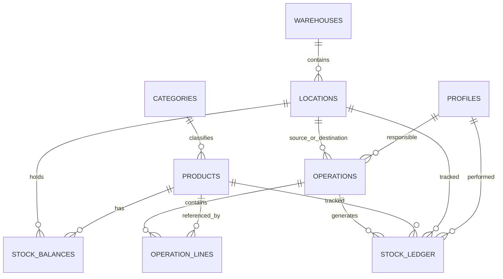

# StockSense — Database Schema (Wireframe-Aligned)

> `01-prd.md` remains unchanged. The database continues to implement the PRD's inventory/ledger model; this revision adds the read-models needed to reproduce the wireframe's screens, especially Move History and the Stock screen's Update Stock action.

## 1. Core Enums

```sql
create type user_role as enum ('manager', 'staff');

create type operation_type as enum (
  'RECEIPT',
  'DELIVERY',
  'TRANSFER',
  'ADJUSTMENT'
);

create type operation_status as enum (
  'DRAFT',
  'WAITING',
  'READY',
  'DONE',
  'CANCELED'
);

create type movement_type as enum (
  'RECEIPT',
  'DELIVERY',
  'TRANSFER_IN',
  'TRANSFER_OUT',
  'ADJUSTMENT'
);
```

## 2. Profiles

`profiles` mirrors `auth.users`.

| Column | Type | Null | Notes |
|---|---|---:|---|
| id | uuid | no | PK/FK to `auth.users(id)` |
| display_name | text | no | display name |
| email | text | no | unique |
| role | user_role | no | default `staff`; not enforced in MVP |
| created_at | timestamptz | no | default now() |
| updated_at | timestamptz | no | default now() |

Signup metadata creates the profile through the existing Auth trigger.

## 3. Categories

```text
categories
- id uuid PK
- name text UNIQUE NOT NULL
- created_at timestamptz NOT NULL
```

## 4. Products

```text
products
- id uuid PK
- name text NOT NULL
- sku text UNIQUE NOT NULL
- category_id uuid NULL FK categories
- unit_of_measure text NOT NULL DEFAULT 'pcs'
- reorder_level numeric(14,3) NOT NULL DEFAULT 0 CHECK >= 0
- unit_cost numeric(14,2) NULL CHECK >= 0
- is_active boolean NOT NULL DEFAULT true
- created_by uuid NULL FK profiles
- created_at timestamptz
- updated_at timestamptz
```

No hard-delete workflow is exposed in MVP.

## 5. Warehouses

```text
warehouses
- id uuid PK
- name text NOT NULL
- short_code text UNIQUE NOT NULL
- address text NULL
- created_at timestamptz
- updated_at timestamptz
```

The wireframe explicitly shows Name, Short Code, Address.

## 6. Locations

```text
locations
- id uuid PK
- warehouse_id uuid NOT NULL FK warehouses ON DELETE RESTRICT
- name text NOT NULL
- short_code text NOT NULL
- created_at timestamptz
- updated_at timestamptz

UNIQUE (warehouse_id, short_code)
```

The wireframe explicitly shows Name, Short Code, Warehouse.

## 7. Operations

One polymorphic row represents each Receipt, Delivery, Transfer, or Adjustment.

```text
operations
- id uuid PK
- type operation_type NOT NULL
- reference text UNIQUE NOT NULL
- status operation_status NOT NULL DEFAULT 'DRAFT'
- scheduled_date date NOT NULL DEFAULT current_date
- responsible_user_id uuid NULL FK profiles
- partner_name text NULL
- source_location_id uuid NULL FK locations
- destination_location_id uuid NULL FK locations
- reason text NULL
- validated_at timestamptz NULL
- canceled_at timestamptz NULL
- created_by uuid NULL FK profiles
- created_at timestamptz
- updated_at timestamptz
```

Type rules:

- Receipt: destination required; source null.
- Delivery: source required; destination null.
- Transfer: source + destination required; source != destination.
- Adjustment: destination used as the adjustment location; source null.
- Waiting only applies to Delivery and Transfer.

### Delivery `Operation Type` field

The wireframe displays an `Operation Type` control on Delivery detail. The supplied requirements do not define a separate persisted concept/value set for that control.

Therefore:

- do not create a speculative enum or column solely from the label;
- if the field is required for the final UI, first define its allowed values and behavior;
- until then, the persisted business operation type remains `DELIVERY`.

## 8. Operation Lines

```text
operation_lines
- id uuid PK
- operation_id uuid NOT NULL FK operations ON DELETE CASCADE
- product_id uuid NOT NULL FK products ON DELETE RESTRICT
- quantity numeric(14,3) NOT NULL CHECK >= 0
- line_number int NOT NULL DEFAULT 1
- created_at timestamptz
```

For Receipt/Delivery/Transfer, quantity must be > 0.

For Adjustment, quantity represents physical count and may be 0.

## 9. Stock Balances

```text
stock_balances
- id uuid PK
- product_id uuid NOT NULL
- location_id uuid NOT NULL
- on_hand numeric(14,3) NOT NULL DEFAULT 0 CHECK (on_hand >= 0)
- updated_at timestamptz

UNIQUE(product_id, location_id)
```

This is the canonical stored stock value.

## 10. Stock Ledger

Append-only:

```text
stock_ledger
- id uuid PK
- product_id uuid NOT NULL
- location_id uuid NOT NULL
- quantity_change numeric(14,3) NOT NULL CHECK (quantity_change <> 0)
- movement_type movement_type NOT NULL
- operation_id uuid NOT NULL
- operation_reference text NOT NULL
- user_id uuid NULL
- created_at timestamptz
```

No `UPDATE` or `DELETE` is allowed through RLS, and a DB trigger blocks mutation even if a privileged path attempts it.

## 11. Free-to-Use View

The Stock wireframe requires both On Hand and Free to Use.

```sql
free_to_use =
  stock_balances.on_hand
  - coalesce(ready_outgoing.reserved_qty, 0)
```

`ready_outgoing` sums operation lines where:

- type is Delivery or Transfer
- status is `READY`
- source location matches the balance location

Create:

```text
stock_with_free_to_use
```

with at least:

```text
product_id
location_id
on_hand
free_to_use
```

and join product/location/warehouse data for the frontend service.

## 12. Wireframe Stock Update Path

The Stock screen must not mutate `stock_balances` directly.

When a user updates a stock row:

1. Create a one-line `ADJUSTMENT`.
2. Use the selected product/location.
3. Set the line quantity to the new physical count.
4. Immediately validate the adjustment in the same controlled business flow.
5. Write one signed `ADJUSTMENT` ledger row.
6. Return the updated stock.

A dedicated convenience RPC is recommended:

```text
update_stock_from_count(
  p_product_id,
  p_location_id,
  p_physical_count,
  p_reason
)
```

Internally it must use the same adjustment/validation logic as a normal Adjustment.

## 13. Wireframe Move History Read Model

The wireframe expects:

```text
Reference | Date | Contact | From | To | Quantity | Status
```

The immutable `stock_ledger` remains the source of truth. Create a read-only view such as:

```text
move_history
```

that joins:

```text
stock_ledger
  -> operations
  -> profiles
  -> products
  -> source/destination locations
  -> warehouses
```

Suggested fields:

```text
ledger_id
operation_id
reference
date
contact
from_location_id
from_location_name
to_location_id
to_location_name
product_id
product_name
quantity_change
quantity_display
movement_type
status
```

Mapping:

- Receipt: From = null, To = destination, quantity positive.
- Delivery: From = source, To = null, quantity negative.
- Transfer OUT: From = source, To = destination, quantity negative.
- Transfer IN: From = source, To = destination, quantity positive.
- Adjustment: From/To may both point to the adjusted location; the signed quantity is the adjustment difference.

If a reference contains multiple products, the view returns multiple rows.

## 14. Reference Generation

References follow the wireframe/PRD pattern:

```text
{WarehouseShortCode}/IN/{ID}
{WarehouseShortCode}/OUT/{ID}
{WarehouseShortCode}/TRF/{ID}
{WarehouseShortCode}/ADJ/{ID}
```

The warehouse prefix is derived server-side from the relevant location.

Recommended sequences:

```text
receipt_ref_seq
delivery_ref_seq
transfer_ref_seq
adjustment_ref_seq
```

Reference generation is never performed by the frontend.

## 15. Indexes

Required:

```text
products(sku UNIQUE)
products(lower(name))
products(category_id)

warehouses(short_code UNIQUE)

locations(warehouse_id, short_code UNIQUE)
locations(warehouse_id)

operations(type, status)
operations(scheduled_date)
operations(reference UNIQUE)
operations(source_location_id)
operations(destination_location_id)

operation_lines(operation_id)
operation_lines(product_id)

stock_balances(product_id, location_id UNIQUE)
stock_balances(location_id)

stock_ledger(product_id, created_at DESC)
stock_ledger(created_at DESC)
stock_ledger(location_id)
stock_ledger(operation_id)
```

## 16. Transaction Rules

`validate_operation` must:

1. Lock the operation row.
2. Re-check status.
3. Lock all relevant source balance rows.
4. Check all Delivery/Transfer shortages before mutating any stock.
5. Apply all balance mutations atomically.
6. Write all ledger rows in the same transaction.
7. Set status to DONE only after successful mutation.
8. Return WAITING without stock changes when a Delivery/Transfer has insufficient Free to Use.

`on_hand >= 0` remains the final DB constraint.

## 17. Entity Relationships



## 18. RLS

MVP behavior remains:

- authenticated users can read operational data;
- authenticated users can create/update allowed entities;
- profiles are self-editable;
- no application-level delete path for Products/Warehouses/Locations;
- ledger is SELECT + controlled INSERT only;
- ledger UPDATE/DELETE is blocked by both RLS and trigger.

## 19. Seed Data

Seed enough data for the wireframe demo:

- one warehouse with Rack A, Rack B, Production Floor
- categories
- Steel Rod and Chair products
- non-zero stock
- sample Receipt and Delivery history
- at least one operation suitable for Move History's multi-row-per-reference rendering
