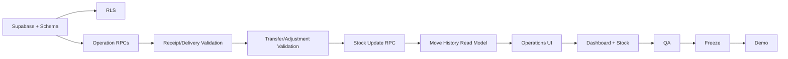

# StockSense — 6-Hour Implementation Plan (Wireframe-Aligned)

Owners:

- **Dev A:** Supabase/Postgres/RPC/RLS/inventory correctness
- **Dev B:** React/UI/UX/frontend integration

`01-prd.md` is not changed by this plan.

## 0:00–0:30 — Foundation

### Dev A

- Create Supabase project.
- Add environment values.
- Create enums.
- Create profiles/categories/products/warehouses/locations.
- Add Auth profile trigger.
- Add initial RLS.

### Dev B

- Scaffold Vite + React + TypeScript.
- Add Tailwind + shadcn/ui.
- Add React Router + TanStack Query.
- Build the wireframe-style top navigation:
  `Dashboard | Operations | Products | Move History | Settings`.
- Build Login/Signup cards.

Deliverable: app boots and auth shell exists.

## 0:30–1:30 — Core Data + Auth

### Dev A

- Create operations + operation_lines.
- Create stock_balances + stock_ledger.
- Add constraints/indexes.
- Add reference generation.
- Add RLS.
- Add seed skeleton.

### Dev B

- Finish Login/Signup/Forgot/Reset.
- Build Dashboard shell.
- Build shared table/search/filter components.
- Build StatusBadge and StatusStepper.
- Build List/Kanban toggle.

Deliverable: authenticated shell + database foundation.

## 1:30–2:30 — Inventory Engine + Wireframe Screens

### Dev A

Implement:

```text
create_operation
update_operation
mark_operation_ready
cancel_operation
validate_operation
stock_with_free_to_use
get_dashboard_summary
move_history
```

Start with Receipt + Delivery validation first.

### Dev B

Build:

- Dashboard Receipt card
- Dashboard Delivery card
- Stock table
- Stock Update UI
- Warehouse form
- Location form
- operation list shell

Deliverable: core wireframe screens are visible.

## 2:30–3:30 — Stock Update + Operations

### Dev A

Finish:

- Transfer validation
- Adjustment validation
- `update_stock_from_count`
- shortage result shape
- Move History read model
- seed data

### Dev B

Build:

- Receipt list/detail
- Delivery list/detail
- List/Kanban toggle
- Search by reference/contact
- status stepper
- Validate/Print/Cancel action bar
- shortage line/error treatment

Deliverable: Receipt + Delivery are demoable end-to-end.

## 3:30–4:30 — Remaining Modules

### Dev A

- Run SQL smoke tests for all operation types.
- Verify row locks and negative-stock constraint.
- Verify ledger immutability.
- Verify Move History mapping.

### Dev B

Build:

- Transfer list/detail
- Adjustment list/detail
- Products
- Move History
- Profile
- print stylesheet

Deliverable: all PRD modules have a working UI path.

## 4:30–5:15 — Integration QA

Both:

- Run the full manual QA checklist.
- Fix P0 stock/operation bugs.
- Fix route/navigation issues.
- Verify every wireframe-visible control.
- Verify List is the default view.
- Verify Search and filters.
- Verify Stock Update.
- Verify Move History columns and movement signs/colors.

Do not add new features during this block.

## 5:15–5:45 — Freeze

- Feature freeze.
- Visual consistency pass.
- Re-run regression tests.
- Reset/re-seed demo data.
- Confirm demo user login.
- Confirm sample stock and operation records.

## 5:45–6:00 — Demo Rehearsal

Exact sequence:

1. Login.
2. Dashboard Receipt/Delivery cards.
3. Open Stock.
4. Create/validate Receipt.
5. Verify stock increase.
6. Create/validate Delivery.
7. Trigger Delivery shortage -> Waiting + highlighted line.
8. Update stock directly from Stock.
9. Validate Transfer.
10. Validate Adjustment.
11. Open Move History.
12. Search by reference/contact.
13. Show multiple product rows under one reference.
14. Show positive/negative movement presentation.

## Critical Path



## If Behind Schedule

Cut in this order:

1. Realtime.
2. Kanban polish (keep the toggle/list behavior if already wired).
3. Print styling beyond a basic browser print stylesheet.
4. Profile editing.
5. Advanced Product filters.
6. Non-essential visual polish.

Do **not** cut:

- Receipt validation
- Delivery shortage/Waiting
- Transfer stock movement
- Adjustment
- Stock Update
- Move History
- negative-stock protection
- ledger immutability

## Ownership Rules

Dev A must not edit React feature/UI files.

Dev B must not edit SQL migrations/RLS/RPC implementation.

Both coordinate through:

- `06-api-contracts.md`
- generated database types
- shared domain terminology

## AI Coding Rules

- Read the wireframe-aligned design before changing UI.
- Reuse shared operation components.
- Never invent missing business semantics.
- Never directly mutate stock from React.
- Never bypass `validate_operation`.
- Keep changes scoped.
- Run typecheck/build after substantial frontend work.
- Run SQL regression checks after inventory RPC changes.
